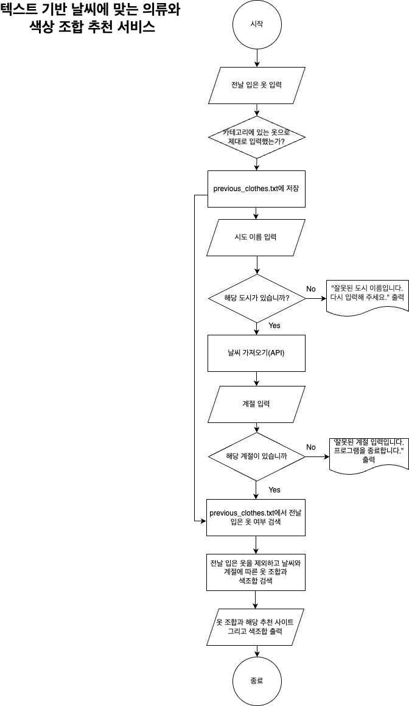

# What to wear : 텍스트 기반 날씨에 맞는 의류와 색상 조합 추천 서비스

## 1.과제 설명
해당 프로그램은 사용자가 입력한 도시와 계절 정보를 바탕으로 현재 날씨 데이터를 가져오고, 그에 맞는 의류와 계절별 색상 조합을 추천하는 기능을 제공합니다.

### 2. 주요 기능 
- 사용자가 어제 입었던 옷을 입력받아, 다음 날 추천 시 우선순위를 낮추는 기능
- 날씨 API 호출을 통해 해당 지역의 실시간 기상 정보를 기반으로 추천
- 날씨 조건에 맞는 적절한 의류 추천 기능
- 계절에 어울리는 색상 조합 제안

### 3. 순서 구성도

1.	날씨 정보 입력: 사용자가 도시와 계절을 선택하여 날씨 정보를 입력
2.	어제 입었던 옷 입력: 어제 입었던 의류 정보를 기록
3.	의류 및 색상 추천: 날씨 및 계절에 맞는 의류와 색상 조합 추천
4.	결과 저장: 추천된 내용을 출력

